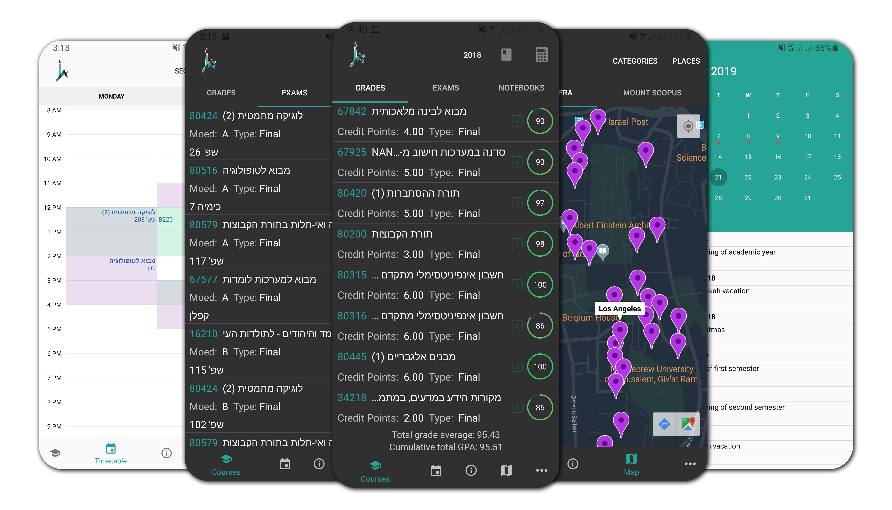

<h1 align="center">
   
  Client for HUJI 
  

    
  

</h1>

An open source third party client for the Hebrew University of Jerusalem

 
 

  

 

## Introduction

Client for HUJI is an improved third party client for the Hebrew University of Jerusalem.

## Features

- Dark mode
- Academic calendar
- Quick access to your timetable with your class rooms on a map
- Access to your upcoming exams, including the exam rooms on a map
- Download your previous exam papers as they're available directly from the app
- Access to your courses, including grades, of any year
- GPA calculator that allows you to plan ahead and check how your GPA is affected by grades
- Quick access to the Shnaton and syllabus for every course listed in the app, as well as any course number
- Complete campus map to help you find restaurants, cafés, libraries, computer stations, and more… including opening times when available
- Quick access to the most important contacts on campus, including Safety, Campus Security, and faculty emails
- Quick access to the campus shuttle times
- Complete caching allows you to browse the previous data, in case you have no internet connection.

License
----------

    Copyright 2019 aabulhaj

    Licensed under the Apache License, Version 2.0 (the "License");
    you may not use this file except in compliance with the License.
    You may obtain a copy of the License at

       http://www.apache.org/licenses/LICENSE-2.0

    Unless required by applicable law or agreed to in writing, software
    distributed under the License is distributed on an "AS IS" BASIS,
    WITHOUT WARRANTIES OR CONDITIONS OF ANY KIND, either express or implied.
    See the License for the specific language governing permissions and
    limitations under the License.
